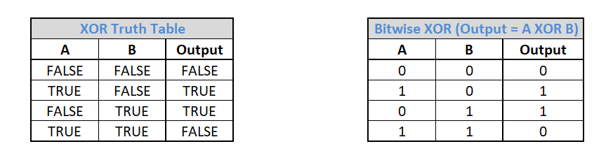
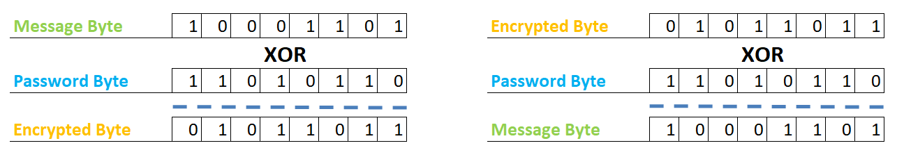

# Stage 4/4: Encrypt the message
## Description
We hid the message well, but one can't be too careful, so let's encrypt the message itself.

Exclusive OR (XOR) is a logical operation whose output is only true when its inputs differ. XOR can also be used on data bits where `1` stands for `true` and `0` stands for `false`. Below you can find both the <b>XOR truth table</b> (on the left) with the input and output values of the XOR operation and the XOR bitwise operation (on the right).



XOR has an interesting mathematical feature: <i>A XOR B = C</i> and <i>C XOR B = A</i>. If <i>A</i> is the message and <i>B</i> the password, then <i>C</i> is the encrypted message. Using <i>B</i> and <i>C</i>, we can reconstruct <i>A</i>.

Below is an example where we use Bytes as a message, a password, and an encrypted message:



Thus, not only the same password can be used for encryption and decryption (<b>symmetric encryption</b>), but also the same simple method. This encryption is very strong if the password is random and has the same size as the message.

In this stage, the user should be asked for a password, and then the message is encrypted before it's hidden in the image.

## Objectives
When the hide command is given and the secret message is input, the user should be prompted for a password with the message `Password:`.

The program reads the password string and converts it to a Bytes Array. The first message byte will be XOR encrypted using the first password byte, the second message byte will be XOR encrypted with the second password byte, and so on. If the password is shorter than the message, then after the last byte of the password, the first byte of the password should be used again.

Three Bytes with values 0, 0, 3 should be added to the encrypted Bytes Array. If the image size is adequate for holding the Bytes array, the result is hidden in the image like in the previous stage.

When the show command is given and the filename is input, the user should be prompted for the password with the message `Password:`. The image should open and the encrypted Bytes Array should be reconstructed just like in the previous stage; the program stops reading it when the bytes with the values 0, 0, 3 are found. The last three bytes should be removed and the encrypted Bytes Array should be decrypted using the password. Finally, the message should be restored to the String type, and the program should print `Message:` and then the message itself on a new line.

## Example
The greater-than symbol followed by a space (`> `) represents the user input. Note that it's not part of the input.

<b>Example 1:</b> <i>Encrypting and decrypting a message.</i>
```
Task (hide, show, exit):
> hide
Input image file:
> travel.png
Output image file:
> enc.png
Message to hide:
> My encrypted message!
Password:
> mypassword
Message saved in enc.png image.
Task (hide, show, exit):
> show
Input image file:
> enc.png
Password:
> mypassword
Message:
My encrypted message!
Task (hide, show, exit):
> exit
Bye!
```

<b>Example 2:</b> <i>Encrypting a message in a very small image.</i>
```
Task (hide, show, exit):
> hide
Input image file:
> small.png
Output image file:
> out2.png
Message to hide:
> abcdefghijk
Password:
> mypassword
The input image is not large enough to hold this message.
Task (hide, show, exit):
> exit
Bye!
```
